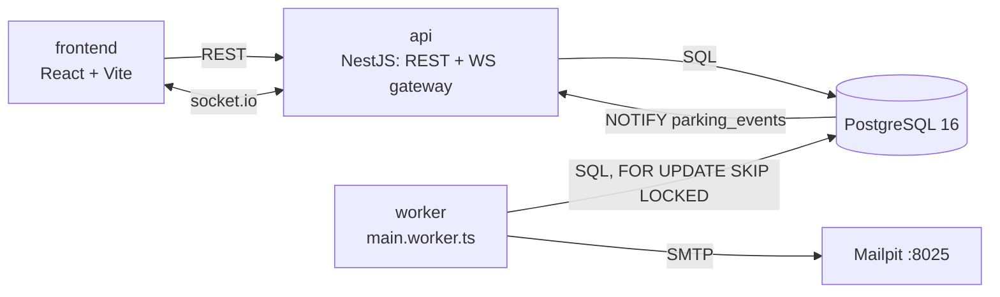
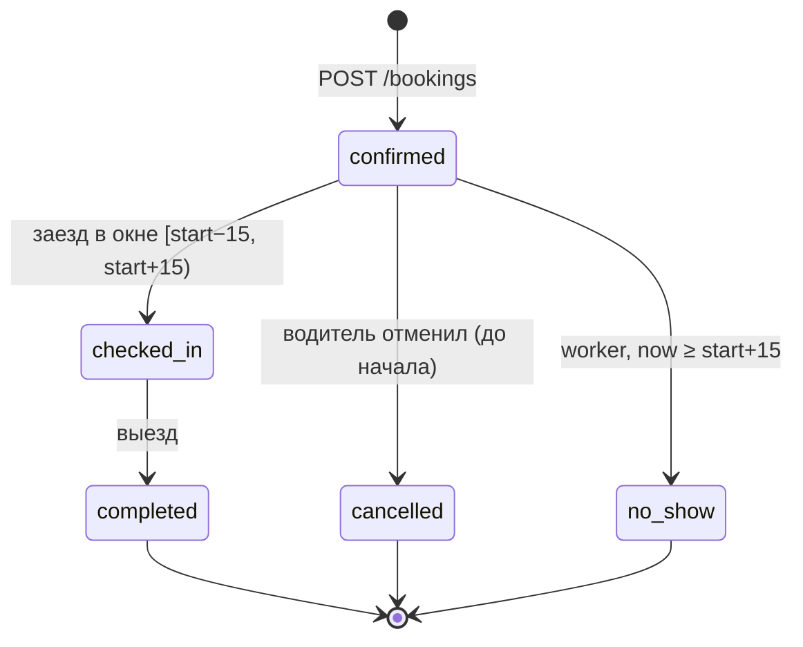
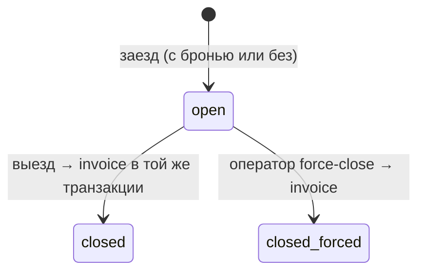

# Архитектура

Документ описывает, как устроен сервис и почему. Доменные решения, на которые он ссылается, — в `DECISIONS.md` (D-xxx). Текст задания — `TASK.md`.

Статус: **проект**, кода ещё нет. Всё ниже — план, а не описание работающей системы.

---

## 0. Обзор



- `api` и `worker` — один NestJS-проект, две точки входа. Worker — standalone application context без HTTP.
- События для realtime рождаются в транзакциях (и в API, и в worker) через `pg_notify('parking_events', …)`. API держит отдельное соединение с `LISTEN parking_events` и пересылает события в socket.io. PostgreSQL доставляет NOTIFY только после COMMIT, поэтому откаченная транзакция события не порождает.
- **Время.** Всё доменное «сейчас» берётся из `Clock`-провайдера и передаётся в SQL параметром `$now`. SQL-функции `now()` / `CURRENT_TIMESTAMP` в доменных запросах не используются, иначе тесты не смогут управлять временем. Хранение — `timestamptz` (UTC), отображение — в TZ парковки.
- **Параметры (env):**

| Переменная | По умолчанию | Смысл |
|---|---|---|
| `PARKING_TZ` | `Asia/Bishkek` | часовой пояс парковки (D-003) |
| `NO_SHOW_GRACE_MIN` | 15 | через сколько после начала брони снимаем no-show |
| `EARLY_ENTRY_MIN` | 15 | насколько раньше начала брони заезд привязывается к ней (D-004) |
| `REMINDER_BEFORE_END_MIN` | 10 | за сколько до конца брони письмо |
| `WORKER_POLL_MS` | 5000 | период тика worker'а |
| `CLOCK_MODE` | `system` | `controllable` включает `POST /api/test/clock` (D-015) |

---

## 1. Разбор «Ожидаемого поведения»

### 1.1 «Занятость мест на схеме меняется у всех, кто её смотрит, без обновления страницы»

| Краевой случай | Как закрываем |
|---|---|
| Изменение произошло в worker (no-show), а сокеты живут в API | Событие идёт через `NOTIFY`, API слушает `LISTEN` и рассылает. |
| Транзакция откатилась после «отправки» события | `pg_notify` внутри транзакции доставляется только на COMMIT. |
| Состояние меняется **по времени** без всяких запросов (бронь вошла в 15-минутное окно, бронь закончилась) | Worker на каждом тике пересчитывает состояния мест и сравнивает со снапшотом `spot_state`; рассылает только изменившиеся (D-011). |
| События пришли не по порядку / дважды | У каждого места монотонный `version`; клиент игнорирует событие с `version` ≤ известной. |
| Вкладка была в фоне, сокет переподключился и пропустил события | На `connect`/`reconnect` клиент инвалидирует запрос `GET /spots` и берёт полный снимок. |
| Несколько инстансов API | Каждый держит свой LISTEN и шлёт своим клиентам. |
| Лимит payload NOTIFY (8000 байт) | В payload только идентификаторы и короткое состояние: `{type, spotId, state, version}`. |
| Две вкладки одного пользователя | Обе в комнате `lot` (и `user:{id}`), получают одно и то же. |

### 1.2 «Две брони на одно место не пересекаются, даже если оформлены одновременно»

| Краевой случай | Как закрываем |
|---|---|
| Гонка «проверили — свободно — вставили» в двух транзакциях | `EXCLUDE USING gist (spot_id WITH =, period WITH &&)` — вторая транзакция получает `23P01`, API отдаёт 409 `BOOKING_CONFLICT` (D-002). |
| Параллельные вставки в EXCLUDE-ограничение | PostgreSQL может отклонить транзакцию как `40P01 deadlock_detected`, причём и такую, чей интервал свободен (она ждала транзакцию, которая сама откатилась; найдено property-тестом). Поэтому создание брони всегда берёт `FOR UPDATE` строки места — брони одного места создаются по очереди, а `40P01` (одна машина на разных местах) повторяется до 3 раз (D-024). |
| Смежные брони 10:00–11:00 и 11:00–12:00 | `tstzrange` полуоткрытый `[)`, пересечения нет — обе проходят. |
| Отменённая / no-show / завершённая бронь не должна блокировать место | Ограничение частичное: `WHERE (status IN ('confirmed','checked_in'))`. |
| Одна машина бронирует два места на одно время | Второе ограничение `EXCLUDE (car_id WITH =, period WITH &&)` с тем же условием → 409 `CAR_ALREADY_BOOKED` (D-009). |
| Время пришло с разными смещениями (`+06:00`, `Z`) | Вход — ISO-8601 с offset, без offset → 422. Хранение в UTC, сравнение корректно. |
| Секунды/миллисекунды в границах | Границы кратны минуте: 422 в DTO и `CHECK` в БД (D-008). |
| Бронь в прошлом, короче 15 мин, длиннее 24 ч, дальше 7 дней | 422 `BOOKING_INVALID_PERIOD` (D-008). |
| Бронь «на сейчас» на место, где физически стоит машина | Создание брони берёт `SELECT … FOR UPDATE` строки места; если начало брони попадает в `[now, now+15)` и на месте открытый визит → 409 `SPOT_OCCUPIED` (D-008). |
| Бронь в обход сервиса (прямой INSERT, другой код) | Ограничение в БД, не в коде — работает для любого клиента. |

### 1.3 «Бронь, на которую не заехали в течение 15 минут после начала, снимается сама»

| Краевой случай | Как закрываем |
|---|---|
| Ровно на границе | Окно заезда по брони `[start − 15, start + 15)`. No-show — при `now ≥ start + 15` (D-004). |
| Гонка «заезд в 14:59:59» против worker'а | Обе транзакции блокируют строку брони `FOR UPDATE`. Заезд привязывается, только если `status = 'confirmed'` и `now < start + 15`; worker снимает, только если всё ещё `confirmed`. Кто первый — тот и прав, второй видит новое состояние. |
| Worker был выключен в момент снятия | Задача выводится из данных: первый же тик после старта находит все просроченные брони и снимает их; письмо и событие отправляются (Q11 → D-006). |
| Два worker'а одновременно | `FOR UPDATE SKIP LOCKED` — каждая бронь обрабатывается одним. |
| Точность | Снятие происходит в пределах `WORKER_POLL_MS` после порога. Для заезда это не важно: заезд проверяет время сам, а не статус. |
| Машина уже внутри как «без брони» (заехала раньше окна) | К ней бронь не привязывается; на `start + 15` бронь становится `no_show`, визит оплачивается по факту, за бронь денег нет (Q4 → D-006). |
| Забронированное место занято пересидевшим водителем | Водитель с бронью получает другое свободное место — это считается прибытием (бронь `checked_in`), пишется аномалия `booked_spot_occupied` (Q6 → D-004). Если мест нет — отказ 409 `NO_FREE_SPOT`, бронь остаётся `confirmed`. |

### 1.4 «За 10 минут до конца брони водителю приходит письмо. Одно.»

| Краевой случай | Как закрываем |
|---|---|
| Повторный тик, перезапуск, два worker'а | Письмо создаётся строкой в `email_outbox` с `UNIQUE (booking_id, kind)` через `INSERT … ON CONFLICT DO NOTHING`. Вторую строку физически не вставить. |
| Бронь отменена / no-show / завершена до момента напоминания | Напоминание создаётся только для `confirmed` и `checked_in` (D-007). |
| Worker лежал, момент напоминания прошёл, бронь ещё идёт | Шлём при старте. |
| Worker лежал, бронь уже закончилась | Строка outbox со статусом `skipped` и аномалия `reminder_missed`: событие учтено, письмо не шлём (Q10 → D-007). |
| Сбой SMTP | Повторы с backoff (`attempts`, `next_attempt_at`), после N попыток — `failed`. |
| Процесс упал между ответом SMTP и COMMIT | Письмо может уйти повторно. Создание письма — ровно одно, доставка — at-least-once; окно — время между ответом SMTP и COMMIT. `Message-ID` детерминирован от `outbox.id`, почтовый клиент может склеить дубль. Это честное ограничение, оно записано в D-007. |
| Бронь короче 10 минут | Невозможна: минимум 15 минут (D-008). |

### 1.5 «Заехал без брони — получаешь свободное место, если оно есть. Счёт считается по факту.»

| Краевой случай | Как закрываем |
|---|---|
| Что считать «свободным» | Активное место, на котором нет открытого визита и нет брони `confirmed`, пересекающей `[now, now + 15)` (D-010). Так место не отдаётся тому, кто через 10 минут приедет по брони. |
| Какое из свободных отдать | С самым поздним следующим началом брони (или вообще без броней), затем по коду. Это уменьшает шанс, что walk-in пересидит до чужой брони. |
| Два walk-in'а за последнее место одновременно | Кандидаты выбираются `FOR UPDATE SKIP LOCKED` по строкам `spots`, второй берёт следующее место. Страховка — частичный уникальный индекс `visits (spot_id) WHERE exited_at IS NULL`. |
| Свободных мест нет | 409 `NO_FREE_SPOT` + аномалия `no_free_spot`, визит не создаётся. |
| Номер не привязан ни к одному профилю | Гость: визит и счёт без владельца, видны оператору (Q9 → D-005). |
| Walk-in стоит дольше, чем до начала чужой брони | Обрабатывается при заезде владельца брони (п. 1.3, последняя строка). |

### 1.6 «Счёт по минутам по тарифу, действующему в это время. Граница дня и ночи, копейки не теряются.»

| Краевой случай | Как закрываем |
|---|---|
| Неполная минута | Длительность округляется вверх до целых минут (Q2 → D-003). |
| Минута, которая начинается до 23:00 и заканчивается после | Стоит по тарифу момента своего начала (D-003). |
| Визит через полночь | Ночной тариф — один отрезок 23:00–07:00, полночь его не режет. |
| Визит на несколько суток | Границы строятся для каждых суток интервала. |
| Тариф поменялся посреди визита | Тарифы версионируются по периоду действия, минута берёт версию, действующую в момент её начала (D-014). |
| Переход на летнее время | Границы считаются Luxon в TZ парковки, а не сдвигом на +6 ч. В Бишкеке DST нет, но тест прогоняется в `Europe/Berlin`. |
| Нулевая длительность | 0 минут, 0 копеек. |
| Потеря копеек | Цены — целые копейки за минуту, сумма — сумма целых произведений, никаких float и делений. |
| Выезд «раньше» заезда | `CHECK (exited_at >= entered_at)`, время только из `Clock`. |

### 1.7 «Выезд без заезда или двойной заезд по одному номеру не ломают учёт»

| Краевой случай | Как закрываем |
|---|---|
| Выезд без открытого визита | 409 `NOT_INSIDE`, запись в `gate_events` и аномалия `exit_without_entry`. Визиты и счета не меняются. |
| Двойной заезд | 409 `ALREADY_INSIDE`, аномалия `double_entry`. Открытый визит остаётся один. |
| Двойной выезд | Второй выезд — это «выезд без заезда». Счёт один (`invoices.visit_id UNIQUE`). |
| Два заезда одного номера параллельно | `UNIQUE (plate) WHERE exited_at IS NULL`; `23505` переводится в `ALREADY_INSIDE`. |
| Два выезда параллельно | Открытый визит берётся `FOR UPDATE`; второй после ожидания не находит открытого визита → `NOT_INSIDE`. |
| Датчик повторил тот же запрос (сеть) | Заголовок `Idempotency-Key`: повтор возвращает сохранённый ответ из `gate_events`, ничего не делает повторно (D-012). Это отличает ретрай от настоящего двойного заезда. |
| `а123вс` и `A 123 BC` — одна машина | Нормализация до сравнения: верхний регистр, без пробелов и дефисов, кириллические двойники → латиница. |
| Мусор вместо номера | 422 `INVALID_PLATE`, запись в журнал и аномалия `invalid_plate`. |
| Машина «застряла» внутри (выезд не зафиксирован) | Оператор закрывает визит вручную (`force-close`) с указанием времени; визит помечается `forced`. |

---

## 2. Модель данных

Идентификаторы — `uuid` (`btree_gist` поддерживает `uuid` в EXCLUDE). Деньги — `integer` копеек. Время — `timestamptz`.

### Таблицы

Схема создаётся миграциями в `backend/src/database/migrations/` (ручной SQL). Статусы — `text` + `CHECK`, все ограничения именованы (D-023): тесты в `backend/test/schema/` проверяют, что сработало именно нужное.

**users** — `id`, `email citext`, `password_hash` (scrypt, D-022), `role`, `created_at`.
`users_email_key UNIQUE (email)` (без учёта регистра), `users_role_check` (`driver` | `operator`).

**cars** — `id`, `user_id → users ON DELETE CASCADE`, `plate`, `created_at`.
`cars_plate_key UNIQUE (plate)` — номер принадлежит максимум одному профилю (D-005); `cars_plate_format_check (plate ~ '^[A-Z0-9]{1,15}$')` — хранится только нормализованный номер.

**spots** — `id`, `code`, `row`, `col` (позиция на схеме), `is_active`.
`spots_code_key UNIQUE (code)`, `spots_row_col_key UNIQUE (row, col)`. Миграция `SeedReferenceData` создаёт 20 мест A01–A10, B01–B10 (D-021).

**tariffs** — `id`, `valid_during tstzrange`, `timezone`, `day_starts_at time`, `night_starts_at time`, `day_price_kop int`, `night_price_kop int`, `created_at`.
`tariffs_no_overlap EXCLUDE USING gist (valid_during WITH &&)` — версии не перекрываются; `tariffs_prices_check` (≥ 0), `tariffs_day_night_check`, `tariffs_valid_during_check` (не пустой). Начальная версия: с 2020-01-01, `Asia/Bishkek`, день 07:00 — 250 коп/мин, ночь 23:00 — 120 коп/мин.

**bookings** — `id`, `user_id`, `car_id`, `spot_id`, `period tstzrange '[)'`, `status`, `checked_in_at`, `released_at`, `cancelled_at`, `created_at`.
- `bookings_no_overlap_per_spot EXCLUDE USING gist (spot_id WITH =, period WITH &&) WHERE (status IN ('confirmed','checked_in'))`
- `bookings_no_overlap_per_car EXCLUDE USING gist (car_id WITH =, period WITH &&) WHERE (…то же…)`
- `bookings_period_bounds_check`: не пустой, конечный, `[start, end)`
- `bookings_period_minute_check`: `mod(extract(epoch FROM lower(period)), 60) = 0` (и для `upper`) — выражение не зависит от `TimeZone` сессии, в отличие от `date_trunc`
- `bookings_status_check`; индексы `(status, lower(period))`, `(status, upper(period))` — для выборок worker'а.

**visits** — `id`, `plate`, `car_id NULL`, `user_id NULL`, `spot_id`, `booking_id NULL`, `entered_at`, `exited_at NULL`, `close_reason`, `created_at`. Визит открыт, пока `exited_at IS NULL`.
- `visits_one_open_per_plate`: `UNIQUE INDEX (plate) WHERE exited_at IS NULL` — одна машина не внутри дважды.
- `visits_one_open_per_spot`: `UNIQUE INDEX (spot_id) WHERE exited_at IS NULL` — одно место не под двумя машинами.
- `visits_booking_id_key UNIQUE (booking_id)`, `visits_plate_format_check`, `visits_exit_after_entry_check`, `visits_close_reason_check` (открыт ⇔ причины нет; закрыт ⇔ `exit` | `forced`).

**invoices** — `id`, `visit_id`, `minutes int`, `amount_kop int`, `breakdown jsonb` (сегменты: версия тарифа, день/ночь, минуты, цена, сумма), `created_at`.
`invoices_visit_id_key UNIQUE (visit_id)`, `invoices_amounts_check` (≥ 0). Счёт создаётся в той же транзакции, что и закрытие визита. Оплата эмулируется (D-013).

**gate_events** — журнал каждого обращения к шлагбауму: `id`, `kind`, `raw_plate`, `plate NULL` (нормализованный, если удалось), `occurred_at`, `idempotency_key NULL`, `outcome`, `error_code`, `response jsonb`, `visit_id NULL`.
`gate_events_idempotency_key_key UNIQUE (idempotency_key)`, `gate_events_kind_check` (`entry` | `exit`), `gate_events_outcome_check` (`ok` | `rejected`), `gate_events_plate_format_check`.

**anomalies** — `id`, `kind`, `plate NULL`, `gate_event_id NULL`, `booking_id NULL`, `details jsonb`, `created_at`.
`anomalies_kind_check`: `exit_without_entry`, `double_entry`, `no_free_spot`, `invalid_plate`, `booked_spot_occupied`, `reminder_missed`.

**email_outbox** — `id`, `booking_id`, `kind`, `to_email citext`, `status` (по умолчанию `pending`), `attempts`, `next_attempt_at`, `sent_at`, `last_error`, `created_at`.
`email_outbox_booking_kind_key UNIQUE (booking_id, kind)` — второе письмо того же вида не создать; `email_outbox_kind_check` (`reminder` | `no_show`), `email_outbox_status_check` (`pending` | `sent` | `failed` | `skipped`), `email_outbox_attempts_check`. Частичный индекс по `next_attempt_at` для `pending`.

**spot_state** — снапшот последнего разосланного состояния: `spot_id PK → spots ON DELETE CASCADE`, `state`, `version bigint`, `updated_at`.
`spot_state_state_check` (`free` | `booked` | `occupied`), `spot_state_version_check` (≥ 0).

### Состояния брони



- `confirmed`, `checked_in` — держат интервал (участвуют в EXCLUDE).
- `completed`, `cancelled`, `no_show` — финальные, интервал освобождается. Ранний выезд → `completed`, остаток интервала доступен другим.
- Бронь, у которой закончился интервал, а машина ещё внутри, остаётся `checked_in` до выезда. Интервал после `end` ей уже не принадлежит, следующие брони не блокируются.

### Состояния визита



### Состояние места (производное, не хранится как истина)

Приоритет: `occupied` (есть открытый визит) > `booked` (есть бронь `confirmed`, пересекающая `[now, now+15)`) > `free`.
Одно и то же правило используется для схемы, для выбора места walk-in'у и для снапшота `spot_state` — одна SQL-функция, а не три копии.

---

## 3. API

Префикс `/api`. Ошибки — `{ "code": "BOOKING_CONFLICT", "message": "..." }`. Авторизация — `Authorization: Bearer <JWT>`.

| Метод и путь | Роль | Описание |
|---|---|---|
| `POST /auth/register` | — | Регистрация водителя (email, пароль от 8 символов) → `{accessToken, user}`. 409 `EMAIL_TAKEN`. Операторы — только из сида. |
| `POST /auth/login` | — | Вход → `{accessToken, user}` (JWT на `JWT_TTL_SECONDS`, по умолчанию 12 ч). 401 `INVALID_CREDENTIALS` — одинаково для неизвестного email и неверного пароля. |
| `GET /me` | любой вошедший | Профиль: id, email, роль, машины. |
| `GET /me/cars` | driver | Мои машины. |
| `POST /me/cars` | driver | Добавить номер (нормализуется: «а 123-вс» → `A123BC`). 409 `CAR_ALREADY_ADDED` (уже у меня) / `PLATE_TAKEN` (у другого профиля), 422 `INVALID_PLATE`. |
| `DELETE /me/cars/:id` | driver | Удалить → 204. 409 `CAR_HAS_HISTORY`, если у машины есть брони или визиты (D-026). |
| `GET /spots` | любой вошедший | Места: `{id, code, row, col, state, version}`. `state` считается на момент запроса той же SQL-функцией `spot_state_at`, что и снапшот; `version` — из `spot_state` (D-011, D-027). |
| `GET /spots/availability?from&to` | любой вошедший | Места, которые можно забронировать на интервал (те же правила, что у `POST /bookings`). |
| `POST /bookings` | driver | Создать бронь `{carId, spotId, from, to}` (ISO 8601 со смещением). 201 / 409 `BOOKING_CONFLICT` / 409 `CAR_ALREADY_BOOKED` / 409 `SPOT_OCCUPIED` / 422 `BOOKING_INVALID_PERIOD` (+ `reason`) / 404 `CAR_NOT_FOUND`, `SPOT_NOT_FOUND`. Пересечения ловит EXCLUDE, а не код. |
| `GET /bookings` | driver | Мои брони (фильтр по статусу). |
| `GET /bookings/:id` | driver | Бронь. |
| `POST /bookings/:id/cancel` | driver | Отмена `confirmed`-брони до её начала (D-026). 409 `BOOKING_NOT_CANCELLABLE`. |
| `GET /visits` | driver | Мои визиты (новые первыми) со счётом: `{id, plate, spot, bookingId, enteredAt, exitedAt, closeReason, invoice}`. Гостевые визиты не видны никому из водителей. |
| `GET /visits/:id` | driver | Визит. Чужой или некорректный id → 404 `VISIT_NOT_FOUND`. |
| `GET /invoices` | driver | Мои счета: `{id, visitId, plate, minutes, amountKop, segments, createdAt}`. |
| `GET /invoices/:id` | driver | Счёт с разбивкой по тарифам (`segments` из `calculateCharge`). Чужой → 404 `INVOICE_NOT_FOUND`. |
| `POST /gate/entry` | operator | Симулятор: заезд `{plate}`, необязательный заголовок `Idempotency-Key`. 201 `{visitId, plate, spot, bookingId, enteredAt}` / 409 `ALREADY_INSIDE` / 409 `NO_FREE_SPOT` / 422 `INVALID_PLATE` / 422 `IDEMPOTENCY_KEY_REUSED` (D-028). |
| `POST /gate/exit` | operator | Симулятор: выезд `{plate}`, `Idempotency-Key`. 200 `{visit, invoice}` / 409 `NOT_INSIDE` / 422 `INVALID_PLATE`. |
| `GET /operator/visits?status=open\|closed` | operator | Все визиты, включая гостевые (последние 500). |
| `POST /operator/visits/:id/force-close` | operator | Закрыть «застрявший» визит. **Не сделано** (отложено ради срока). |
| `GET /operator/anomalies` | operator | Журнал аномалий, новые первыми. |
| `GET /operator/gate-events` | operator | Журнал обращений к шлагбауму (в том числе отклонённых), новые первыми. |
| `GET /tariffs` | любой | Действующий и будущие тарифы. |
| `GET /health` | — | Проверка живости (API + БД). |
| `POST /test/clock` | — | Только при `CLOCK_MODE=controllable`: установить/сдвинуть время для E2E и демо (D-015). В обычном режиме маршрут не регистрируется. |

Чужие ресурсы отдают 404 (не 403), чтобы не раскрывать существование.

---

## 4. Realtime

socket.io, JWT передаётся в handshake (`auth.token`). Комнаты:
- `lot` — все вошедшие;
- `user:{id}` — личные события водителя;
- `operators` — операторы.

| Событие | Payload | Кому | Когда |
|---|---|---|---|
| `spot.updated` | `{spotId, state, version}` | `lot` | Любая мутация, меняющая состояние места (бронь в ближайшие 15 мин, отмена, заезд, выезд, no-show), и тик worker'а при смене состояния по времени. |
| `booking.updated` | `{bookingId, status}` | `user:{id}` | `checked_in`, `completed`, `cancelled`, `no_show`. |
| `visit.updated` | `{visitId, status: open\|closed, plate, spotId, amountKop?}` | `user:{id}` (если не гость), `operators` | Заезд, выезд (с суммой), force-close. |
| `anomaly.created` | `{id, kind, plate}` | `operators` | Новая аномалия. |
| `sync.required` | `{}` | `lot` | API восстановил LISTEN-соединение: события за время обрыва потеряны, клиент перезапрашивает данные. |
| `session.ready` | `{userId, role}` | сокету | Комнаты назначены — с этого момента клиент ничего не пропускает. |

Путь события: доменная транзакция → `pg_notify('parking_events', json)` → COMMIT → LISTEN-соединение API → `server.to(room).emit(...)`.

Состояние места пишется в `spot_state` (с `version + 1`) в той же транзакции, что и мутация, и только если состояние реально поменялось. Поэтому API и worker не шлют лишних событий.

Клиент: событие патчит кэш TanStack Query (`setQueryData`) с проверкой `version`; на `connect`/`reconnect` — `invalidateQueries(['spots'])`.

---

## 5. Worker

Цикл: тик каждые `WORKER_POLL_MS`. Задачи тика выполняются по очереди, каждая — короткими транзакциями с батчами `LIMIT 50 … FOR UPDATE SKIP LOCKED`. Внутренних таймеров на конкретные брони нет.

| # | Задача | Выборка | Действие |
|---|---|---|---|
| 1 | Снятие no-show | `status = 'confirmed' AND lower(period) + grace ≤ $now` | `status = 'no_show'`, `released_at = $now`; outbox `(booking_id, 'no_show')`; `spot_state` + NOTIFY; `booking.updated`. |
| 2 | Напоминания | `status IN ('confirmed','checked_in') AND upper(period) − reminder ≤ $now` и нет строки outbox `(id, 'reminder')` | Если `upper(period) > $now` — outbox `pending`; иначе — `skipped` + аномалия `reminder_missed`. `ON CONFLICT DO NOTHING`. |
| 3 | Отправка писем | `email_outbox.status = 'pending' AND next_attempt_at ≤ $now` | SMTP (nodemailer → Mailpit) → `sent`. Ошибка → `attempts + 1`, `next_attempt_at` с экспоненциальным backoff, после 5 попыток — `failed`. |
| 4 | Снапшот мест | все активные места | Пересчитать состояние, обновить строки `spot_state`, где оно поменялось (`version + 1`), NOTIFY по каждой. |

Пример выборки (задача 1):

```sql
SELECT id FROM bookings
WHERE status = 'confirmed' AND lower(period) + make_interval(mins => $2) <= $1
ORDER BY lower(period)
LIMIT 50
FOR UPDATE SKIP LOCKED;
```

**После перезапуска.** В памяти ничего не хранится: «что пора сделать» выводится из таблиц и `$now`. Первый тик после старта догоняет всё пропущенное: снимает просроченные брони (Q11), создаёт или пропускает напоминания (Q10), досылает `pending`-письма, выравнивает снапшот мест. Повторная обработка невозможна из-за смены статуса и уникального ключа outbox.

**Несколько worker'ов** безопасны: `SKIP LOCKED` раздаёт строки разным процессам, `ON CONFLICT` защищает outbox.

**Тестируемость.** `WorkerService.tick()` — публичный метод; тесты вызывают его напрямую с `FakeClock`, без ожидания реального времени.

**Остановка.** По SIGTERM worker дожидается текущей транзакции и выходит; незавершённое подхватит следующий запуск.

---

## 6. Тарификация

Чистая функция без I/O — `backend/src/tariffing/calculate-charge.ts`, контракт в `tariffing.types.ts` (D-025). Модуль не зависит от NestJS, БД и остального приложения — это закреплено правилом ESLint.

```ts
calculateCharge({ enteredAt: Date, exitedAt: Date, tariffs: TariffVersion[], timeZone: string })
  → { minutes: number; amountKop: number; segments: ChargeSegment[] }
// ChargeSegment: { tariffId, kind: 'day' | 'night', from, to, minutes, pricePerMinuteKop, amountKop }
```

**Правила (D-003, D-014):**
1. `N = ceil((exitedAt − enteredAt) / 1 мин)` — неполная минута округляется вверх.
2. Минута `i` (0 ≤ i < N) начинается в `enteredAt + i мин`.
3. Цена минуты — по версии тарифа, действующей в момент её начала, и по дневной/ночной части этой версии в локальном времени парковки.
4. Итог — сумма целых копеек.

**Алгоритм без перебора минут.** Точки разреза на `[enteredAt, enteredAt + N мин)`: границы версий тарифа; все моменты, когда локальные часы парковки показывают время границы (07:00, 23:00), — после перевода часов назад таких моментов два; моменты перевода часов (часы могут «перепрыгнуть» границу или откатиться через неё, ни разу её не показав). Для каждого куска `[a, b)` с постоянной ценой число минут, **начинающихся** в нём:

```
count = ceil((b − enteredAt) / 1 мин) − ceil((a − enteredAt) / 1 мин)
```

`amountKop = Σ count × price`. Соседние куски с той же версией и тем же видом (день/ночь) склеиваются. Сегмент результата — непрерывная серия целых минут: `from` — начало первой, `to` — конец последней, поэтому сегменты без зазоров покрывают `[enteredAt, enteredAt + N мин)`, а минута, начавшаяся в 22:59:30, целиком входит в дневной сегмент (его `to` = 23:00:30). Поминутный перебор используется только в тестах как эталон.

Некорректный вход — ошибка `TariffingError`, а не «какой-то» счёт: невалидная дата, выезд раньше заезда, неизвестный часовой пояс, минута без действующей версии тарифа, битый или пересекающийся тариф (D-025).

### Примеры

Парковка в `Asia/Bishkek` (UTC+6, в БД 23:00 местного = 17:00 UTC). Тариф: день 07:00–23:00 — **250 коп/мин** (2,50), ночь 23:00–07:00 — **120 коп/мин** (1,20). Время — местное.

| # | Заезд → выезд | Разбор | Итог |
|---|---|---|---|
| 1 | 10:00:00 → 11:30:00 | 90 мин дня × 250 | **22 500 коп** (225,00) |
| 2 | 22:40:00 → 23:20:00 (граница день → ночь) | 20 мин дня (22:40–22:59) × 250 = 5 000; 20 мин ночи (23:00–23:19) × 120 = 2 400 | **7 400 коп** (74,00) |
| 3 | 22:58:30 → 23:01:10 (минута через границу) | 160 с → 3 мин. Начала минут: 22:58:30, 22:59:30 — день; 23:00:30 — ночь. 2 × 250 + 1 × 120. По формуле: день `ceil(1,5) − 0 = 2`, ночь `ceil(3,0) − ceil(1,5) = 1` | **620 коп** (6,20) |
| 4 | 04.10 21:15 → 05.10 07:05 (через полночь и утреннюю границу) | день 21:15–23:00 = 105; ночь 23:00–07:00 = 480 (полночь не режет); день 07:00–07:05 = 5; всего 590 = N. 110 × 250 = 27 500; 480 × 120 = 57 600 | **85 100 коп** (851,00) |
| 5 | 31.10 23:30 → 01.11 00:30 (смена версии тарифа) | с 01.11 00:00 действует версия с ночью 150 коп/мин. 30 × 120 = 3 600; 30 × 150 = 4 500 | **8 100 коп** (81,00) |

---

## 7. План доказательства

Все тесты на инварианты — на реальном PostgreSQL (testcontainers), без моков БД. Время — `FakeClock`.

| Требование | Тест | Уровень |
|---|---|---|
| Схема обновляется у всех без перезагрузки | Два socket.io-клиента; заезд через `POST /gate/entry` → оба получают `spot.updated` с новой `version`. No-show через `worker.tick()` → оба получают событие (путь worker → NOTIFY → API). Откат транзакции → события нет. | интеграционный |
| то же, в браузере | Два browser context: оператор делает заезд в одном, схема во втором меняется без reload. | E2E (Playwright) |
| Брони не пересекаются при одновременном оформлении | 20 параллельных `POST /bookings` на одно место с пересекающимися интервалами → ровно один 201, остальные 409. Прямой INSERT в обход сервиса → `23P01`. Смежные интервалы → оба 201. Отменённая бронь не мешает новой. Одна машина на два места → 409 `CAR_ALREADY_BOOKED`. | интеграционный |
| то же, свойство | fast-check: случайный набор интервалов отправляется параллельно → принятые попарно не пересекаются, отказанные действительно пересекались с принятой. | property + БД |
| No-show через 15 минут | Бронь со стартом T: тик в T+14:59 → `confirmed`; тик в T+15:00 → `no_show`, место `free`, событие, outbox `no_show`. Заезд в T+14 → `checked_in`, тик в T+20 не трогает. Заезд в T+15 → walk-in, не по брони. | интеграционный |
| Снятие после простоя, без дублей | Время сдвинуто на T+2ч без тиков, новый экземпляр worker → снятие на первом тике. Два `tick()` параллельно → одно снятие, одна строка outbox. | интеграционный |
| Одно письмо за 10 минут до конца | Тики в end−11 (нет), end−10 (одна строка), end−5 (без изменений); два worker'а параллельно → одна строка, одно письмо в Mailpit (проверка через HTTP API Mailpit). Отменённая бронь → 0 писем. Простой до end+1 → `skipped` + `reminder_missed`. | интеграционный |
| Заезд без брони → свободное место | Заезд без брони → визит на свободном месте. Место с бронью, стартующей через 10 мин, не выдаётся. Мест нет → 409 `NO_FREE_SPOT` + аномалия. Два параллельных заезда за последнее место → один визит, второй 409. | интеграционный |
| Пересидевший и бронь (Q6) | Walk-in занял место, на него приезжает владелец брони → получает другое место, аномалия `booked_spot_occupied`. | интеграционный |
| Счёт по минутам, день/ночь, копейки | Примеры 1–5 из §6 как юнит-тесты. fast-check: результат совпадает с поминутным перебором; Σ минут сегментов = N; более длинный визит не дешевле; результат целый. Тест в `Europe/Berlin` через переход на летнее/зимнее время. | unit + property |
| Выезд без заезда / двойной заезд | Выезд без заезда → 409 + аномалия, визитов и счетов не прибавилось. Двойной заезд → 409 + аномалия, открытый визит один. Двойной выезд → один счёт. Параллельные заезды одного номера → один визит. Повтор с тем же `Idempotency-Key` → тот же ответ, одно событие. Частичные уникальные индексы проверяются прямыми INSERT. | интеграционный |
| Нормализация номеров | `'а 123 вс'` → `'A123BC'`, смешанные алфавиты, пробелы, регистр; свойство `normalize(normalize(x)) = normalize(x)`. | unit + property |
| История визитов и счетов | `GET /visits` и `GET /invoices` возвращают только свои записи с разбивкой; чужой id → 404. | интеграционный |
| Профиль водителя | Регистрация, вход, добавление машины; номер, занятый другим профилем → 409. | интеграционный |

Когда тесты появятся, эта таблица переедет в `README.md` как таблица доказательств со ссылками на файлы тестов и честным статусом каждой строки.
